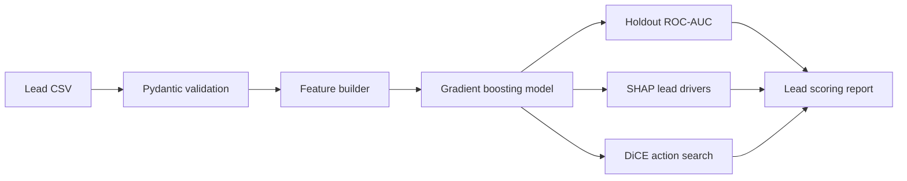
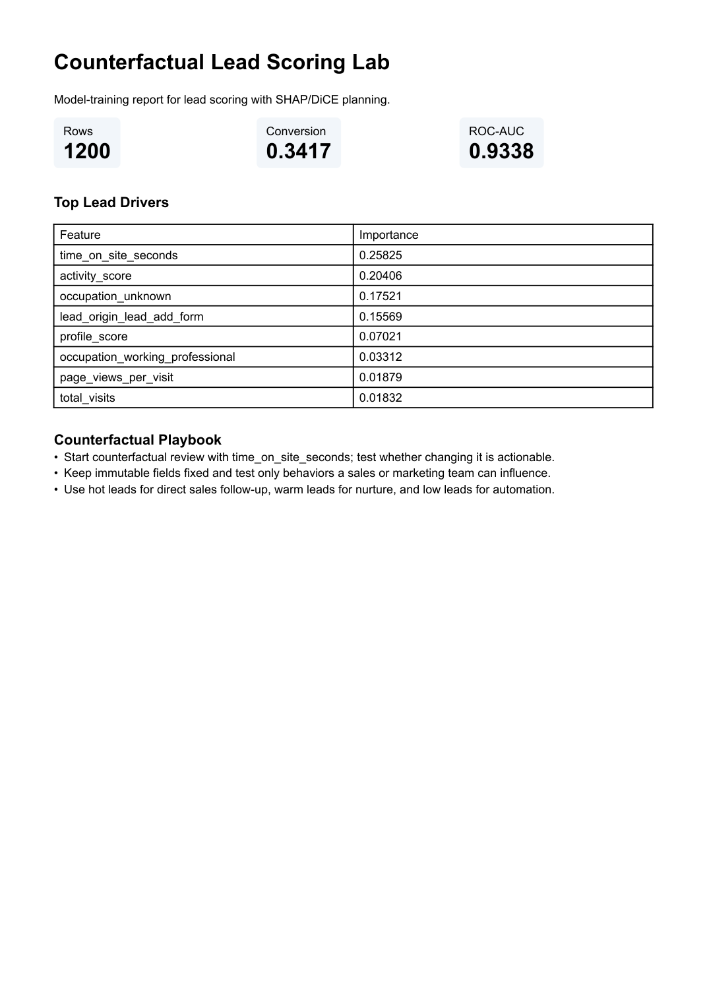

# Counterfactual Lead Scoring Lab

Litestar service for training lead scoring models with Pydantic v2 validation, SHAP-style driver review, and DiCE counterfactual planning.



## What It Solves

Lead scoring is weak when it only returns a probability. This project keeps the useful parts: validated input, trained model, explainable drivers, and counterfactual actions that can be reviewed before routing leads to sales.

## Sample Output

The committed sample report is generated from the Kaggle Lead Scoring dataset after schema
normalization.



- [PDF report](docs/samples/lead_scoring_report.pdf)
- [Prepared lead dataset](examples/leads.csv)

## Stack

Litestar, Pydantic v2, pandas, scikit-learn, SHAP, DiCE, Typer, pytest, ruff.

## Quickstart

```bash
python -m venv .venv
.venv\Scripts\activate
pip install -e ".[dev]"
lead-score-prepare-kaggle --out examples/leads.csv
python -m pytest
python -m ruff check .
lead-score-lab train
```

Run the API:

```bash
uvicorn counterfactual_lead_scoring_lab.api:app --reload
```

## API

| Endpoint | Purpose |
|---|---|
| `POST /v1/train` | Train a lead scoring model from a local CSV path |
| `POST /v1/score` | Score one lead against the trained intake schema |
| `GET /v1/explainability-contract` | Document SHAP and DiCE use |
| `GET /health` | Health check |

The public sample is prepared from the Kaggle Lead Scoring dataset. The model uses only lead
attributes and engagement fields available before conversion.

See [Leakage Policy](docs/leakage_policy.md) for the no-post-conversion feature contract.
